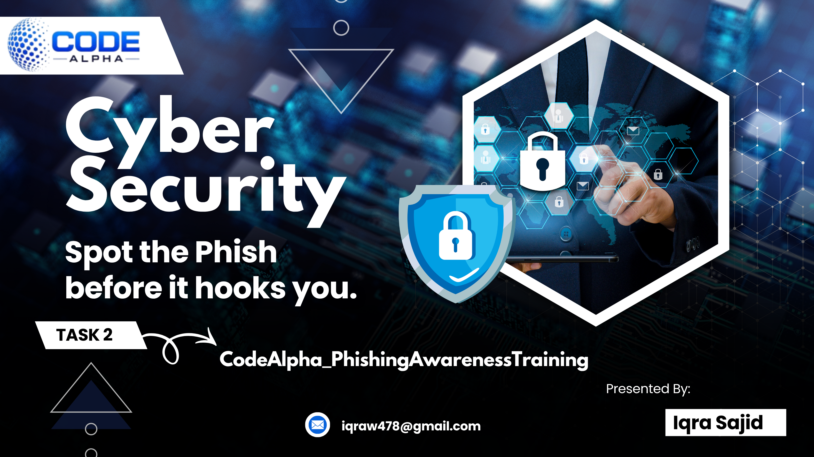

# CodeAlpha_PhishingAwarenessTraining

Interactive **Phishing Awareness Training** module built for the **CodeAlpha Cyber Security Internship — Task 2**.

🔗 **Live look:** open `CodeAlpha_PhishingAwarenessTraining.html` in any browser (no server required).

---

## 📌 About the Project

This project is a self-contained, interactive web module that educates users on how to identify and defend against phishing attacks — one of the most common cyber threats today. It was built entirely with **HTML, CSS, and vanilla JavaScript**, with no external dependencies or frameworks.

## ✨ Features

- **Cover / intro page** — presentation-style landing section
- **Phishing basics** — email phishing, spear phishing, smishing & vishing explained
- **Anatomy of a phishing email** — an annotated, hoverable example highlighting real red flags
- **Fake website detection** — side-by-side comparison of real vs. spoofed URLs
- **Social engineering tactics** — urgency, authority, fear, reward, and trust explained with examples
- **Real-world case studies** — notable phishing incidents and their impact
- **Best practices checklist** — practical, actionable tips to stay safe
- **Interactive quiz** — 5 scenario-based questions with instant feedback and a final score

## 🛠️ Tech Stack

- HTML5
- CSS3 (custom, responsive design)
- Vanilla JavaScript (no libraries/frameworks)

## 🚀 How to Run

1. Clone or download this repository
2. Open `CodeAlpha_PhishingAwarenessTraining.html` directly in any web browser

   **or**, to run via a local server (e.g. XAMPP):
   - Copy the project folder into `htdocs`
   - Start Apache from the XAMPP Control Panel
   - Visit `http://localhost/CodeAlpha_PhishingAwarenessTraining/CodeAlpha_PhishingAwarenessTraining.html`

No installation, build step, or dependencies required.

## 📂 Files

| File | Description |
|------|--------------|
| `CodeAlpha_PhishingAwarenessTraining.html` | Main training module (all content, styling, and quiz logic) |
| `cover.png` | Cover/title image used on the landing section |

## 🎯 Internship Task Reference

**Domain:** Cyber Security
**Task 2:** Phishing Awareness Training
- ✅ Presentation/module focused on phishing attacks
- ✅ How to recognize phishing emails and fake websites
- ✅ Social engineering tactics used by attackers
- ✅ Best practices and tips
- ✅ Real-world examples and an interactive quiz

## 👤 Author

**Iqra Sajid**
📧 iqraw478@gmail.com

---

*Built as part of the CodeAlpha Internship Program.*
